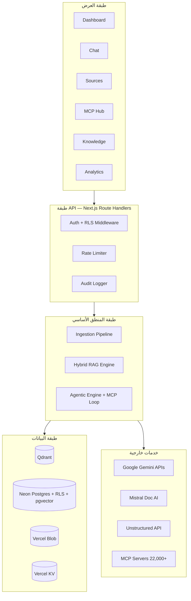

# System Overview and Technology Decisions

## 1. الغرض والنطاق

يقدّم هذا القسم الصورة المعمارية الشاملة لمنصة **OmniRAG** ويوثّق القرارات التقنية على المستوى الاستراتيجي قبل الدخول في تفاصيل المكوّنات والبيانات في [Components, Data Model, and API Surface](./02-components-data-model-and-api-surface.md) والقرارات التفصيلية في [Cross-Cutting Concerns, ADRs, and Risks](./03-cross-cutting-concerns-adrs-and-risks.md).

**خارج النطاق:** تفاصيل الجداول والأعمدة الكاملة، مخططات REST الكاملة، تنفيذات الأمان الدقيقة — جميعها مغطاة في الأقسام التالية.

## 2. الرؤية المعمارية في سطر واحد

تطبيق ويب **Serverless بالكامل** مبني على **Next.js 16** يقدّم Hybrid RAG ثنائي اللغة (عربي/إنجليزي) مع **عزل تام لكل مستخدم** عبر خمس طبقات، وواجهة وكيل ذكي (**Agentic RAG**) تستهلك أدوات عبر بروتوكول **MCP 2026-07-28** عديم الحالة.

## 3. المبادئ المعمارية الحاكمة (Architectural Principles)

| المبدأ | التطبيق في OmniRAG | التحقق |
|---|---|---|
| **Tenant Isolation by Default** | كل عملية قراءة/كتابة مُلزَمة بـ `tenant_id` على المستويات الخمسة | اختبار RLS، اختبار فلترة Qdrant payload |
| **Stateless First** | خوادم MCP عديمة الحالة، Vercel Serverless، بدون Sticky Sessions | نشر خلف Load Balancer عادي |
| **Bilingual by Design** | معالجة عربية أصيلة (تطبيع، RTL، FTS) في كل طبقة وليست طبقة مستقلة | E2E لاستعلامات عربية صرفة |
| **Progressive Disclosure** | تحميل شرائح المعرفة عند الطلب لتقليل السياق المُمرَّر للنموذج | قياس متوسط رموز السياق |
| **Cost-Aware Routing** | توجيه ديناميكي بين `gemini-3.5-flash-lite` و`gemini-3.6-flash` حسب التعقيد | تقرير CostTracker يقلب القرارات |
| **Defense in Depth** | 5 طبقات عزل + تشفير + RLS + فلترة Payload + Middleware + Audit Log | اختبار اختراق ربع سنوي |
| **Contract over Code** | اختبارات + Evals (rubrics) هي العقد مع الذكاء الاصطناعي | CI يفشل عند انحدار الجودة |

## 4. المكدّس التقني المعتمد (Approved Stack)

### 4.1 الطبقة الأمامية والخلفية الأحادية

| المكوّن | التقنية المختارة | الإصدار المستهدف | المبررات |
|---|---|---|---|
| إطار العمل | **Next.js** | 16.x مع App Router | دعم RSC، Edge Runtime، تكامل أصيل مع Vercel، Server Actions |
| اللغة | **TypeScript** | 5.x (strict) | منع أخطاء النوع في طبقات API و MCP |
| واجهة المستخدم | **React** + Server Components | 19.x | تقليل JavaScript المُرسَل ودعم SSR |
| التنسيق | **Tailwind CSS** | 4.x | إنتاجية عالية ودعم RTL أصيل عبر `dir="rtl"` |
| إدارة الحالة | **Zustand** للحالة المحلية + **TanStack Query** للبيانات البعيدة | أحدث مستقر | بساطة Zustand مع إمكانيات التخزين المؤقت في TanStack Query |

### 4.2 الذكاء الاصطناعي والنماذج

| الطبقة | النموذج | الاستخدام | المبرر |
|---|---|---|---|
| التضمين (Embedding) | `gemini-embedding-2` (3072 dim) | تضمين المستندات والاستعلامات عبر 100+ لغة | متعدد الوسائط، متعدد اللغات، أبعاد ثابتة |
| الاستدلال السريع | `gemini-3.5-flash-lite` | تلخيص، استخراج، تصنيف، أسئلة مباشرة | أقل تكلفة وأقل زمن استجابة |
| الاستدلال المتقدم | `gemini-3.6-flash` | تحليل معمّق، استدلال متعدد الخطوات، سياقات طويلة | نافذة 1M رمز، كفاءة أعلى في الرموز |

**اتجاه المعالجة:** `gemini-embedding-2` → `Qdrant` + `Neon FTS` → `RRF Fusion` → `gemini-3.6-flash` (افتراضي) أو `gemini-3.5-flash-lite` (للتكلفة).

### 4.3 معالجة المستندات (OCR/Parsing)

| الخيار | الاستخدام | متى يُستخدم | المبرر |
|---|---|---|---|
| **Mistral Document AI (OCR 4)** | OCR للمستندات الممسوحة ضوئياً وPDF المعقد | عند الحاجة لـ 170 لغة + صناديق إحاطة | دقة OCR مؤسسية |
| **Unstructured Transform API** | تحويل 60+ نوع ملف إلى Markdown/JSON | سير العمل الافتراضي للملفات المتنوعة | تنوع أنواع الملفات والقدرة على المعالجة بالجملة |
| **معالج داخلي** | نص عادي وMarkdown | fallback سريع | تقليل التكلفة للملفات البسيطة |

**وضع Auto:** يختار النظام المحرك الأنسب تبعاً لنوع الملف ونتائج فحص أولي.

### 4.4 طبقة البيانات

| المخزن | التقنية | الدور | المبرر |
|---|---|---|---|
| البحث المتجهي | **Qdrant Cloud** | تخزين التضمينات + فلترة بـ `tenant_id` payload | أداء ANN، HNSW، فلترة صارمة |
| البيانات العلائقية | **Neon Postgres** (Serverless) | بيانات وصفية + FTS + جداول MCP + `pgvector` احتياطي | RLS أصلي، فروع فورية، توافق SQL |
| التخزين المؤقت | **Vercel KV** (Redis) | جلسات، نتائج بحث شائعة، rate limiting | زمن وصول < 10ms |
| تخزين الملفات | **Vercel Blob** أو S3-compatible | ملفات خام بمسار `/{tenant_id}/files/*` | تكامل مع Vercel |

### 4.5 المهام الخلفية

| التقنية | الاستخدام | المبرر |
|---|---|---|
| **Inngest** (أساسي) | استيعاب، إعادة تضمين، مزامنة مصادر، فحوصات صحة MCP | أنماط workflows طويلة، idempotency، إعادة محاولة |
| **Trigger.dev** (بديل) | بديل في حال تطلّب المنتج deployment ذاتي | توافق ممتاز مع Next.js |

### 4.6 المصادقة والـ Identity

| الطبقة | التقنية | المبرر |
|---|---|---|
| OAuth/OIDC | **NextAuth.js** (Auth.js) | توافق Next.js + Vercel |
| MFA اختياري | TOTP عبر `otplib` | معيار صناعي |
| إدارة الجلسات | Vercel KV + JWT قصير + Refresh | توازن بين الأداء والأمان |

### 4.7 بروتوكول MCP

| الإصدار | المواصفة | الحزم | الحالة |
|---|---|---|---|
| **MCP 2026-07-28** | Stateless، بدون `initialize`، Resource Indicators إلزامية | `@modelcontextprotocol/client@2.0` و`@modelcontextprotocol/server@2.0` | **مطلوب** |
| RFC 8707 | Resource Indicators في OAuth | مدمج في SDK | **مطلوب** |
| RFC 9207 | التحقق من `iss` | يدوي في OAuth handler | **مطلوب** |

## 5. الطبقات المعمارية (Architectural Layers)

## 6. قيود التصميم عالية المستوى (High-Level Constraints)

| القيد | البيان | الأثر على القرارات |
|---|---|---|
| **C1: GDPR/HIPAA/PCI-ready** | لا يجوز تخزين بيانات حساسة دون تشفير + سجل تدقيق + مسار حذف | تشفير AES-256 في الراحة، Audit Log، واجهة `DELETE /settings/account` |
| **C2: Serverless فقط** | لا خوادم دائمة، كل شيء قابل للتوسع الأفقي | Stateless MCP، جلسات في KV، RLS بدلاً من stateful filters |
| **C3: دعم RTL/LTR أصلي** | الواجهة والتجربة ثنائية اللغة بشكل كامل | `dir` ديناميكي، خطوط عربية، FTS ثنائي |
| **C4: زمن استجابة < 3 ثوانٍ P95** | للرد على استعلام متوسط | Edge Functions للمصادقة، Streaming SSE، توجيه للنموذج الأرخص للمهام البسيطة |
| **C5: لا Hallucination في الوضع المقيّد** | الوضع Private يجيب حصرياً من بيانات المستخدم | System Prompt يُلزم النموذج، Citation إلزامي، Score Threshold قابل للتعديل |
| **C6: حدود تكلفة** | كل مستخدم له Quota قابل للضبط | Rate Limiting + Quota + توجيه ذكي + تخزين مؤقت |
| **C7: توافق مع MCP 2026-07-28** | لا sessions، Resource Indicators، RFC 9207 | يُحظر استخدام أي عميل/خادم MCP قبل 2026-07-28 |

## 7. نموذج العزل متعدد الطبقات (5-Layer Isolation)

| # | الطبقة | التقنية | التحقق |
|---|---|---|---|
| 1 | **المصادقة** | JWT مع `tenant_id` مضمّن + MFA اختياري | اختبار اختراق المصادقة |
| 2 | **Postgres RLS** | `ENABLE ROW LEVEL SECURITY` + `SET app.current_tenant` لكل اتصال | اختبارات SQL تحاول اختراق RLS |
| 3 | **Qdrant Payload** | `tenant_id` إلزامي في كل فلتر بحث | اختبار محاولة قراءة نقطة بمستخدم آخر |
| 4 | **File Storage** | مسارات `/{tenant_id}/files/*` + Signed URLs مؤقتة | اختبار صلاحية Signed URL |
| 5 | **API Middleware** | يُلزم `tenant_id` في كل Route Handler | اختبارات E2E عبر tenants متعددة |

**القاعدة الذهبية:** إذا فشل أي اختبار اختراق في أي طبقة، يُمنع النشر حتى الإصلاح.

## 8. خطوط الأنابيب الجوهرية (Pipelines)

### 8.1 خط أنابيب الاستيعاب (Ingestion)

`File/URL/Integration → Validate → Blob Storage → Processing (Mistral|Unstructured|Internal) → Arabic Normalization → Smart Chunking → Embedding (gemini-embedding-2) → Dual Storage (Qdrant + Neon FTS)`.

### 8.2 خط أنابيب الاستعلام الهجين (Hybrid Query)

`User Query → Language Detection + Intent Detection → HyDE Expansion → Parallel: Semantic (Qdrant) + Lexical (Neon FTS) → RRF Fusion → Optional Cross-Encoder Rerank → Context Assembly → Generation (routed model) → Post-processing (citations, confidence)`.

### 8.3 حلقة الوكيل (Agentic Loop) — وضع MCP

`Query → Tool Planning → Tool Call (MCP) → Validation → Re-plan (max 5 iterations) → Final Generation → Side-Effect Confirmation (if any) → Audit Log`.

## 9. القرارات المعمارية الكبرى (Architectural Decisions — ملخص)

| # | القرار | البديل المرفوض | السبب | ADR مرتبط |
|---|---|---|---|---|
| AD-01 | **Hybrid RAG (Semantic + Lexical) مع RRF** | Semantic فقط | الدقة في المصطلحات الدقيقة وعلامات المنتجات وأسماء الأعلام | يُوثّق تفصيلياً في القسم 3 |
| AD-02 | **Qdrant للبحث المتجهي + Neon pgvector احتياطي** | pgvector فقط | أداء Qdrant في ANN أعلى 10× لـ 3072-dim | يُوثّق في القسم 3 |
| AD-03 | **MCP 2026-07-28 (Stateless)** | مواصفة 2025 مع sessions | قابلية التوسع خلف LB عادي، تكلفة أقل | يُوثّق في القسم 3 |
| AD-04 | **Smart Model Routing** | نموذج واحد فقط | توفير 50-70% من تكلفة LLM حسب البيانات المرجعية | يُوثّق في القسم 3 |
| AD-05 | **Vercel كمنصة نشر أساسية** | AWS/GCP مباشرة | تكامل أصيل، Edge، تكلفة صفرية للـ Cold Start | يُوثّق في القسم 3 |
| AD-06 | **عزل صارم لكل مستخدم (ليس Workspace فقط)** | Multi-tenant DB shared | التوافق مع HIPAA وPCI وتقليل مخاطر Cross-tenant leakage | يُوثّق في القسم 3 |
| AD-07 | **NextAuth.js للـ Identity** | Clerk / WorkOS | تحكم كامل في tenant_id داخل JWT، تكلفة أقل على المدى الطويل | يُوثّق في القسم 3 |

## 10. النطاقات غير المغطاة عمداً (Out of Scope — هذا الإصدار)

| البند | السبب | البديل |
|---|---|---|
| Mobile native apps | التركيز على الويب أولاً | لاحقاً عبر نفس الـ API |
| Self-hosted Qdrant | زيادة التعقيد التشغيلي | Qdrant Cloud |
| نماذج محلية (Ollama/vLLM) | زمن الاستجابة وتكلفة البنية | عبر تكامل MCP لاحقاً |
| Multi-modal RAG كامل | يدعم التضمين متعدد الوسائط في Gemini لكن U/I غير جاهز | المرحلة 2 |
| Fine-tuning مخصص | يتطلب بيانات كافية + MLOps pipeline | غير مخطط |

## 11. معايير القبول المعمارية (Architectural Acceptance Criteria)

لكي يُعتبر هذا القسم "مُحكماً" يجب أن تنجح جميع الفحوصات التالية:

- [ ] **AC-1:** كل مكوّن في القسم 2 (الرؤية) قابل للتعقب إلى مكوّن في القسم 2 ([Components](./02-components-data-model-and-api-surface.md)).
- [ ] **AC-2:** كل قرار في القسم 9 له ADR مطوّل في القسم 3 ([Cross-Cutting](./03-cross-cutting-concerns-adrs-and-risks.md)) قبل البدء بالتنفيذ.
- [ ] **AC-3:** كل قيد في القسم 6 مُغطّى باختبار آلي أو تقييم (eval) قبل إطلاق GA.
- [ ] **AC-4:** المكدّس في القسم 4 مُثبت عبر `package.json` واحد وقابل للتكرار عبر `pnpm install`.
- [ ] **AC-5:** طبقات العزل الخمس (القسم 7) تملك اختبار اختراق مكتوب في CI.
- [ ] **AC-6:** خطوط الأنابيب الثلاثة (القسم 8) لها مخططات Mermaid قابلة للقراءة ومحدّثة.
- [ ] **AC-7:** معايير الأداء والتكلفة مذكورة صراحةً لكل خط أنابيب.
- [ ] **AC-8:** أي انحراف عن هذا القسم أثناء التنفيذ يوجب إصدار ADR جديد قبل الـ merge.

## 12. إشارات إلى الأقسام التالية

| الموضوع | القسم التالي |
|---|---|
| تفصيل المكوّنات والعلاقات والمخطط العلائقي الكامل | [Components, Data Model, and API Surface](./02-components-data-model-and-api-surface.md) |
| تفصيل قرارات الأمان، التوسع، ADRs كاملة، المخاطر، والاختبارات | [Cross-Cutting Concerns, ADRs, and Risks](./03-cross-cutting-concerns-adrs-and-risks.md) |

---

**تنبيه لهندسة الوكلاء (Agentic Engineering Hint):** عند تنفيذ أي ميزة جديدة، يجب على الوكيل: (1) التحقق من أن الميزة مُعرّفة في القسم 2 من [Components](./02-components-data-model-and-api-surface.md)، (2) التأكد من وجود ADR مُوافق عليه في [Cross-Cutting](./03-cross-cutting-concerns-adrs-and-risks.md) إذا كان القرار جديداً، (3) كتابة اختبارات (deterministic) + evals (rubrics/LM judges) قبل كتابة الكود، (4) عدم تعديل هذا القسم إلا عبر PR يوثّق تغيير المعمارية.