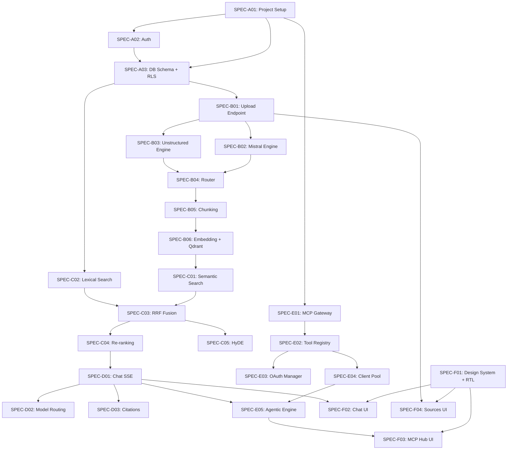

# Agent-Sized Task Decomposition

> يقسّم هذا القسم المواصفات إلى بطاقات تنفيذ (Spec Cards) بحجم يمكن لوكيل ذكاء اصطناعي واحد استيعابه وتنفيذه في جلسة عمل واحدة. كل بطاقة تحمل معرّفاً فريداً، ومعايير نجاح قابلة للقياس، ووضع التشغيل المُوصى به (Conductor أو Orchestrator)، ونقاط التحقق المطلوبة. للمرجع الأعلى، انظر [Delivery Strategy and Milestones](./01-delivery-strategy-and-milestones.md).

## 1. إرشادات التحجيم (Sizing Heuristics)

قبل تفكيك العمل، تُطبَّق القواعد التالية على أي مهمة ليتم تصنيفها كـ "بحجم وكيل":

| المعيار | الحد الأقصى لمهمة بحجم وكيل |
|---|---|
| **سطور الكود المُضافة/المُعدَّلة** | 400 — 800 سطر منطقي (بدون boilerplate) |
| **عدد الملفات المُنشأة** | 8 ملفات كحد أقصى |
| **عدد نقاط النهاية البرمجية الجديدة** | 5 نقاط نهاية (endpoints) |
| **عدد جداول قاعدة البيانات** | 2 جداول مرتبطين |
| **عدد الاعتماديات الخارجية** | 3 مكتبات جديدة كحد أقصى |
| **مدة التنفيذ المتوقعة** | 25 — 45 دقيقة في جلسة واحدة |
| **عدد الملفات المُختبرة** | كل ملف جديد مرتبط باختبار واحد على الأقل |

إذا تجاوزت المهمة هذه الحدود، تُقسَّم إلى بطاقات فرعية قبل الإسناد.

## 2. مصفوفة الأوضاع (Mode Matrix)

وفق ورقة "The New SDLC with Vibe Coding"، يُحدَّد وضع التشغيل تبعاً لطبيعة المهمة:

| الوضع | متى يُستخدم | النموذج المُوصى |
|---|---|---|
| **Conductor** | مهمة محددة المعالم، يمكن للوكيل تنفيذها بخطوات واضحة مع تحقق بشري عند نقاط التوقف | `gemini-3.6-flash` أو نموذج أكبر |
| **Orchestrator** | مهمة متعددة الوكلاء، تحتاج تنسيقاً أو معالجة استثناءات أو تفريعاً لاتخاذ القرار | `gemini-3.6-flash` كمنسّق + `gemini-3.5-flash-lite` للمهام الفرعية |

في OmniRAG، الوضع الافتراضي هو **Conductor** لمهام البنية التحتية، و**Orchestrator** لمهام خط أنابيب RAG الهجين وطبقة MCP Gateway لأنها تتطلب تفريعاً واختياراً بين مسارات بديلة (Mistral مقابل Unstructured، بحث دلالي مقابل معجمي).

## 3. بطاقات التنفيذ الأساسية (Core Implementation Spec Cards)

### المرحلة A — البنية التحتية والمصادقة (Infrastructure & Auth)

#### SPEC-A01: تهيئة مشروع Next.js 16 والبيئة متعددة البيئات

| البند | التفصيل |
|---|---|
| **المعرّف** | SPEC-A01 |
| **الوصف** | إنشاء مشروع Next.js 16 بـ App Router وTypeScript صارم، وتكوين متغيرات البيئة لـ Neon وQdrant وGemini وMistral وUnstructured، مع فصل `development`/`staging`/`production` |
| **الملفات** | `package.json`، `tsconfig.json`، `next.config.ts`، `.env.example`، `lib/env.ts` (Zod validation) |
| **الوضع** | Conductor |
| **معايير النجاح** | تشغيل `pnpm build` بدون أخطاء؛ تشغيل `pnpm typecheck` بـ 0 خطأ؛ رفع ملف `lib/env.ts` يفشل التطبيق عند غياب أي متغير حساس؛ توثيق كل متغير في `.env.example` |
| **اختبارات مطلوبة** | اختبار وحدة لـ `lib/env.ts` يغطي الحالات: متغيرات ناقصة، قيم غير صالحة، تحميل ناجح |
| **التقييمات المطلوبة** | — |
| **مخاطر معروفة** | تجاهل قيود Vercel Edge Runtime على مكتبات Node الأصلية |

#### SPEC-A02: تكامل NextAuth.js مع Clerk + عزل المستأجرين

| البند | التفصيل |
|---|---|
| **المعرّف** | SPEC-A02 |
| **الوصف** | إعداد Clerk كمزود مصادقة، إنشاء `tenant_id` تلقائياً عند أول تسجيل، حقن `tenant_id` في جلسة JWT |
| **الملفات** | `app/api/auth/[...nextauth]/route.ts`، `lib/auth/session.ts`، `middleware.ts`، `types/auth.d.ts` |
| **الوضع** | Conductor |
| **معايير النجاح** | تسجيل مستخدم جديد يُنشئ سجلاً في `users` تلقائياً؛ كل طلب API يحمل `tenant_id` في الـ JWT؛ اختبار middleware يعيد توجيه الطلبات غير المصادق عليها إلى `/auth/login` |
| **اختبارات مطلوبة** | اختبار تكامل لمحاولة استعلام بدون `tenant_id` يُرفض بـ 401 |
| **التقييمات المطلوبة** | مراجعة يدوية لمسار تسجيل OAuth (Google + GitHub) |
| **مخاطر معروفة** | سباق بين إنشاء المستخدم وإدراج سجل `users` في Postgres |

#### SPEC-A03: مخطط قاعدة البيانات الأولي مع Row-Level Security

| البند | التفصيل |
|---|---|
| **المعرّف** | SPEC-A03 |
| **الوصف** | إنشاء الجداول الأساسية (`users`, `sources`, `documents`, `chunks`, `conversations`, `messages`) مع سياسات RLS كاملة وفهارس FTS |
| **الملفات** | `db/migrations/001_initial_schema.sql`، `db/migrations/002_rls_policies.sql`، `lib/db/client.ts`، `lib/db/rls-context.ts` |
| **الوضع** | Conductor |
| **معايير النجاح** | تشغيل جميع الترحيلات على Neon دون أخطاء؛ اختبار يحاول قراءة بيانات `tenant_A` بجلسة `tenant_B` يُرجع 0 صفوف؛ فهرس GIN يعمل على `chunks.content_tsv` للبحث بالعربية والإنجليزية |
| **اختبارات مطلوبة** | اختبار RLS يغطي كل جدول بثلاث حالات: قراءة، إدراج، حذف عبر مستأجرين مختلفين |
| **التقييمات المطلوبة** | — |
| **مخاطر معروفة** | نسيان `SET LOCAL app.current_tenant` قبل كل استعلام |

### المرحلة B — خط أنابيب الاستيعاب (Ingestion Pipeline)

#### SPEC-B01: نقطة نهاية رفع الملفات مع تخزين آمن

| البند | التفصيل |
|---|---|
| **المعرّف** | SPEC-B01 |
| **الوصف** | إنشاء `POST /api/v1/documents/upload` يقبل ملفات متعددة، يتحقق من النوع والحجم، يُخزّنها في Vercel Blob بمسار معزول `/tenant_id/...`، يُنشئ سجل `documents` بحالة `pending` ويُطلق مهمة Inngest |
| **الملفات** | `app/api/v1/documents/upload/route.ts`، `lib/storage/blob.ts`، `lib/validation/upload.ts`، `inngest/functions/document-uploaded.ts` |
| **الوضع** | Orchestrator (يركّب رفع + تخزين + إطلاق مهمة + تسجيل) |
| **معايير النجاح** | رفع ملف PDF بنجاح يُنشئ سجلاً في `documents`؛ رفع ملف يتجاوز الحد الأقصى يُرجع 413؛ توقيع Blob URL يعمل 15 دقيقة فقط؛ الـ task يُطلق في Inngest |
| **اختبارات مطلوبة** | اختبار حد الحجم، اختبار MIME validation، اختبار tenant isolation في مسار التخزين |
| **التقييمات المطلوبة** | اختبار يدوي لرفع 5 ملفات دفعة واحدة |
| **مخاطر معروفة** | اختطاق MIME type عبر رفع بايتات خبيثة بصيغة مزيفة |

#### SPEC-B02: معالج Mistral Document AI للمستندات المعقدة

| البند | التفصيل |
|---|---|
| **المعرّف** | SPEC-B02 |
| **الوصف** | إنشاء دالة `extractWithMistral` تستدعي Mistral Document AI OCR 4، تستخرج النص مع الحفاظ على بنية الجداول والعناوين، تلتقط `bbox` ودرجات الثقة |
| **الملفات** | `lib/ingestion/engines/mistral.ts`، `lib/ingestion/types.ts`، `inngest/functions/process-mistral.ts` |
| **الوضع** | Conductor |
| **معايير النجاح** | معالجة PDF ممسوح ضوئياً يُرجع نصاً بمستوى ثقة > 0.8؛ معالجة PDF عربي بـ 170 لغة مدعومة؛ التكلفة لا تتجاوز $X لكل صفحة (محسوبة في اختبار) |
| **اختبارات مطلوبة** | اختبار لقطة مع 3 ملفات نموذجية (عربي، إنجليزي، مختلط) |
| **التقييمات المطلوبة** | تقييم LM لـ جودة استخراج النص بالعربية (rubric: دقة OCR، الحفاظ على ترتيب القراءة RTL، اكتمال الجداول) |
| **مخاطر معروفة** | اختناق Rate Limits لـ Mistral عند رفع دفعات كبيرة |

#### SPEC-B03: معالج Unstructured Transform للتنوع في أنواع الملفات

| البند | التفصيل |
|---|---|
| **المعرّف** | SPEC-B03 |
| **الوصف** | إنشاء دالة `extractWithUnstructured` تتعامل مع 60+ نوع ملف، تُرجع هيكلاً موحداً مع بيانات وصفية لكل chunk |
| **الملفات** | `lib/ingestion/engines/unstructured.ts`، `inngest/functions/process-unstructured.ts` |
| **الوضع** | Conductor |
| **معايير النجاح** | معالجة DOCX, XLSX, PPTX, EPUB, HTML, MD تنجح دون تدخل يدوي؛ الـ metadata يحتوي على `languages_detected` |
| **اختبارات مطلوبة** | مصفوفة اختبار عبر 8 أنواع ملفات شائعة |
| **التقييمات المطلوبة** | تقييم لمقارنة جودة الإخراج بين Mistral وUnstructured على نفس PDF |
| **مخاطر معروفة** | Unstructured API قد يُعيد عناصر `unclassified` بكثرة |

#### SPEC-B04: التوجيه التلقائي بين المحركات

| البند | التفصيل |
|---|---|
| **المعرّف** | SPEC-B04 |
| **الوصف** | بناء `routeToEngine` يختار المحرك الأنسب تبعاً لنوع الملف وحجمه ولغته المكتشفة؛ يمكن للمستخدم تجاوز التوجيه في الإعدادات |
| **الملفات** | `lib/ingestion/router.ts`، `lib/ingestion/language-detector.ts` |
| **الوضع** | Orchestrator |
| **معايير النجاح** | PDF ممسوح يذهب تلقائياً إلى Mistral؛ ملف `text/markdown` يذهب إلى المعالج الداخلي؛ ملف مختلط اللغات يُرسل لـ Unstructured |
| **اختبارات مطلوبة** | جدول قرارات مع 12 حالة إدخال ونتائجها المتوقعة |
| **التقييمات المطلوبة** | — |
| **مخاطر معروفة** | كشف اللغة الخاطئ لملفات مختلطة قد يُسيء اختيار المحرك |

#### SPEC-B05: التقسيم الذكي متعدد اللغات (Chunking)

| البند | التفصيل |
|---|---|
| **المعرّف** | SPEC-B05 |
| **الوصف** | بناء `chunkDocument` يدعم 5 استراتيجيات (فقري، جُملي، عناوين، دلالي، هجين) مع تطبيع النص العربي وحماية الجمل من القطع في منتصفها |
| **الملفات** | `lib/chunking/strategies/*.ts`، `lib/chunking/arabic-normalizer.ts`، `lib/chunking/index.ts` |
| **الوضع** | Orchestrator |
| **معايير النجاح** | نص عربي لا يُقطع داخل جملة؛ نسبة التداخل قابلة للضبط (0% — 30%)؛ كل chunk يحمل `language` و`section_title`؛ متوسط طول chunk يطابق `chunkSize` ± 15% |
| **اختبارات مطلوبة** | اختبار 10 وثائق نموذجية (PDF, DOCX, MD) مع كل استراتيجية |
| **التقييمات المطلوبة** | تقييم LM لـ جودة القطع في نص عربي ديني/أدبي |
| **مخاطر معروفة** | المكتبات المفتوحة مثل `langchain-text-splitters` لا تتعامل بشكل صحيح مع RTL |

#### SPEC-B06: التضمين بمتجهات Gemini وتخزين Qdrant

| البند | التفصيل |
|---|---|
| **المعرّف** | SPEC-B06 |
| **الوصف** | استدعاء `gemini-embedding-2` بـ `task: retrieval_document` لكل chunk، تخزين المتجهات في Qdrant مع Payload يحتوي `tenant_id` كفلتر إلزامي |
| **الملفات** | `lib/embeddings/gemini.ts`، `lib/vector/qdrant-client.ts`، `lib/vector/payload.ts` |
| **الوضع** | Conductor |
| **معايير النجاح** | كل chunk يُولّد متجهاً بأبعاد 3072؛ استعلام بحث بدون `tenant_id` filter يُسجل كخطأ؛ Batch Embedding لـ 100 chunk في أقل من 30 ثانية |
| **اختبارات مطلوبة** | اختبار التخزين + اختبار استرجاع بفلتر مستأجر |
| **التقييمات المطلوبة** | تقييم جودة التضمين على استعلامات عربية (rubric: recall@10) |
| **مخاطر معروفة** | Qdrant Cloud quota limits عند الاستخدام الكثيف |

### المرحلة C — البحث والاستعلام (Retrieval & Hybrid Search)

#### SPEC-C01: البحث الدلالي في Qdrant مع Cross-Lingual

| البند | التفصيل |
|---|---|
| **المعرّف** | SPEC-C01 |
| **الوصف** | بناء `semanticSearch` يستدعي `gemini-embedding-2` بـ `task: retrieval_query`، يبحث في Qdrant بفلتر `tenant_id` و`collection_ids` اختياري |
| **الملفات** | `lib/search/semantic.ts`، `lib/search/types.ts` |
| **الوضع** | Conductor |
| **معايير النجاح** | استعلام بالعربية يُرجع نتائج من مستندات إنجليزية والعكس (cross-lingual)؛ زمن الاستجابة p95 < 800ms |
| **اختبارات مطلوبة** | مجموعة استعلامات ثنائية اللغة مع ground truth |
| **التقييمات المطلوبة** | تقييم Recall@5 وMRR عبر 50 استعلام مرجعي |
| **مخاطر معروفة** | تكلفة استدعاء Embedding في كل استعلام |

#### SPEC-C02: البحث المعجمي عبر Postgres FTS مع دعم العربية

| البند | التفصيل |
|---|---|
| **المعرّف** | SPEC-C02 |
| **الوصف** | تكوين `tsvector` مع قاموس عربي، بناء استعلام `to_tsquery` مع تطبيع النص قبل البحث |
| **الملفات** | `db/migrations/003_fts_arabic.sql`، `lib/search/lexical.ts` |
| **الوضع** | Conductor |
| **معايير النجاح** | البحث عن كلمة "العزل" يرجع المستندات التي تحتويها مع التعامل مع الهمزات؛ البحث عن "AI" يرجع النتائج في نص عربي مختلط |
| **اختبارات مطلوبة** | 30 استعلام اختباري مع نتائج متوقعة |
| **التقييمات المطلوبة** | تقييم لمقارنة نتائج البحث المعجمي قبل وبعد التطبيع |
| **مخاطر معروفة** | Arabic Snowball Stemmer قد لا يتعامل مع بعض الأشكال النادرة |

#### SPEC-C03: دمج النتائج بـ Reciprocal Rank Fusion

| البند | التفصيل |
|---|---|
| **المعرّف** | SPEC-C03 |
| **الوصف** | بناء `fuseResults` يستخدم RRF بمعامل k=60 قابل للضبط، يدعم أوزان مخصصة للبحث الدلالي والمعجمي |
| **الملفات** | `lib/search/fusion/rrf.ts`، `lib/search/fusion/types.ts` |
| **الوضع** | Conductor |
| **معايير النجاح** | أوزان `semanticWeight=0.7` و`lexicalWeight=0.3` تؤثر فعلياً على ترتيب النتائج؛ اختبار مقارنة RRF مع Weighted Sum |
| **اختبارات مطلوبة** | اختبار وحدة RRF مع قوائم مُرتبة مُحددة |
| **التقييمات المطلوبة** | تقييم NDCG@10 لتأكيد تحسن الجودة على Hybrid مقابل Semantic فقط |
| **مخاطر معروفة** | — |

#### SPEC-C04: إعادة الترتيب بـ Cross-Encoder

| البند | التفصيل |
|---|---|
| **المعرّف** | SPEC-C04 |
| **الوصف** | إضافة طبقة re-ranking اختيارية لتحسين ترتيب أعلى 20 نتيجة قبل التجميع النهائي |
| **الملفات** | `lib/search/reranker.ts` |
| **الوضع** | Conductor |
| **معايير النجاح** | re-ranking يحسن NDCG@10 على مجموعة اختبار مرجعية؛ زمن العملية الإضافية p95 < 500ms |
| **اختبارات مطلوبة** | مقارنة نتائج مع/بدون re-ranking على 30 استعلام |
| **التقييمات المطلوبة** | تقييم لمدى تحسن جودة الترتيب المرصود |
| **مخاطر معروفة** | زيادة زمن الاستجابة الكلي قد تكون غير مقبولة في أوضاع الـ Flash-Lite |

#### SPEC-C05: توسيع الاستعلام بـ HyDE وترجمة ثنائية

| البند | التفصيل |
|---|---|
| **المعرّف** | SPEC-C05 |
| **الوصف** | توليد إجابة افتراضية (Hypothetical Document) للاستعلام، تضمينها، ثم البحث بالتمثيل المُوسَّع |
| **الملفات** | `lib/search/query-expansion/hyde.ts`، `lib/search/query-expansion/translate.ts` |
| **الوضع** | Orchestrator |
| **معايير النجاح** | HyDE يحسن Recall@10 على استعلامات قصيرة/غامضة بنسبة > 5%؛ الاستعلام ثنائي اللغة يُترجم للجهة المقابلة ويُجرى بحث موحد |
| **اختبارات مطلوبة** | مقارنة جودة الاسترجاع قبل/بعد التوسيع |
| **التقييمات المطلوبة** | تقييم LM لجودة الإجابة الافتراضية المولّدة |
| **مخاطر معروفة** | HyDE يضيف استدعاء نموذج إضافي (تكلفة + زمن) |

### المرحلة D — التوليد والمحادثة (Generation & Chat)

#### SPEC-D01: نقطة نهاية المحادثة مع Streaming SSE

| البند | التفصيل |
|---|---|
| **المعرّف** | SPEC-D01 |
| **الوصف** | إنشاء `POST /api/v1/chat/completions` يستخدم Vercel AI SDK مع `streamText`، يبث الإجابة عبر Server-Sent Events |
| **الملفات** | `app/api/v1/chat/completions/route.ts`، `lib/chat/stream.ts`، `lib/chat/system-prompt.ts` |
| **الوضع** | Conductor |
| **معايير النجاح** | أول chunk يصل للعميل في < 2 ثانية؛ قطع الاتصال يُنهي البث دون انهيار؛ السياق المُسترجع مُرفق بالاستدعاء |
| **اختبارات مطلوبة** | اختبار التدفق + اختبار قطع الاتصال |
| **التقييمات المطلوبة** | اختبار يدوي لتجربة المستخدم (latency perceived) |
| **مخاطر معروفة** | Vercel Serverless timeout (max 5 دقائق افتراضياً) |

#### SPEC-D02: توجيه النماذج حسب التعقيد

| البند | التفصيل |
|---|---|
| **المعرّف** | SPEC-D02 |
| **الوصف** | بناء `classifyComplexity` يوجه الاستعلام إلى `gemini-3.5-flash-lite` أو `gemini-3.6-flash` بناءً على طول الاستعلام ووجود كلمات دالة |
| **الملفات** | `lib/routing/complexity.ts`، `lib/routing/model-selector.ts` |
| **الوضع** | Conductor |
| **معايير_SUCCESS** | أسئلة بسيطة (طول < 50 كلمة، لا "تحليل"/"قارن") تذهب لـ Flash-Lite؛ التحليل المقارن يذهب لـ Flash؛ المستخدم يمكنه التجاوز اليدوي |
| **اختبارات مطلوبة** | مجموعة 100 استعلام مصنّفة يدوياً للتحقق |
| **التقييمات المطلوبة** | تقييم لمعدل الخطأ في التصنيف ومدى تأثيره على جودة الإجابة |
| **مخاطر معروفة** | التصنيف الخاطئ يُقلل الجودة دون أن يلاحظ المستخدم |

#### SPEC-D03: إرفاق المراجع ودرجات الثقة

| البند | التفصيل |
|---|---|
| **المعرّف** | SPEC-D03 |
| **الوصف** | بعد توليد الإجابة، استخراج المراجع من chunks المُسترجعة، حساب درجة ثقة بناءً على تشابه النتائج وتوافقها |
| **الملفات** | `lib/chat/citations.ts`، `lib/chat/confidence.ts` |
| **الوضع** | Conductor |
| **معايير النجاح** | كل ادعاء في الإجابة مرفق بمرجع chunk؛ درجة ثقة < 0.5 تُفعّل تنبيه "إجابة غير مؤكدة" |
| **اختبارات مطلوبة** | اختبار أن كل citation يطابق chunk_id حقيقي في قاعدة البيانات |
| **التقييمات المطلوبة** | تقييم LM لمدى دقة المراجع في 20 إجابة نموذجية |
| **مخاطر معروفة** | هلوسة المراجع (نموذج يخترع مراجع) |

### المرحلة E — طبقة MCP Gateway

#### SPEC-E01: معالج MCP Gateway Stateless (مواصفة 2026-07-28)

| البند | التفصيل |
|---|---|
| **المعرّف** | SPEC-E01 |
| **الوصف** | إنشاء `/api/mcp/[...path]/route.ts` باستخدام `@modelcontextprotocol/server` v2.0، كل طلب مستقل بدون sessions |
| **الملفات** | `app/api/mcp/[...path]/route.ts`، `lib/mcp/server-factory.ts` |
| **الوضع** | Conductor |
| **معايير النجاح** | طلب `tools/list` يعمل خلف load balancer round-robin؛ كل طلب يحمل tenant_id من الـ headers؛ الاختبار بـ MCP Inspector ينجح |
| **اختبارات مطلوبة** | اختبار 10 طلبات متتالية بأحمال متوازية |
| **التقييمات المطلوبة** | اختبار يدوي مع MCP Inspector الرسمي |
| **مخاطر معروفة** | — |

#### SPEC-E02: سجل الأدوات الديناميكي (Tool Registry)

| البند | التفصيل |
|---|---|
| **المعرّف** | SPEC-E02 |
| **الوصف** | تسجيل أدوات البحث، جلب البيانات، التفاعل الخارجي، وإدارة قاعدة المعرفة في `MCPToolRegistry` مع مخططات Zod صارمة |
| **الملفات** | `lib/mcp/registry/search.ts`، `lib/mcp/registry/fetch.ts`، `lib/mcp/registry/actions.ts`، `lib/mcp/registry/knowledge.ts` |
| **الوضع** | Orchestrator |
| **معايير_SUCCESS** | 15 أداة مُسجلة ومُختبرة؛ كل أداة تحمل `tenant_id` إلزامياً؛ أدوات Side Effect مُعلَّمة بصريح |
| **اختبارات مطلوبة** | اختبار كل أداة بمدخلات صالحة + غير صالحة |
| **التقييمات المطلوبة** | مراجعة بشرية لوصف كل أداة (وضوح، اكتمال) |
| **مخاطر معروفة** | الأخطاء في Zod schema قد تُسقط الطلبات في الإنتاج |

#### SPEC-E03: إدارة OAuth 2.0 مع RFC 8707 + RFC 9207

| البند | التفصيل |
|---|---|
| **المعرّف** | SPEC-E03 |
| **الوصف** | تنفيذ تدفق OAuth كامل مع PKCE، Resource Indicators، التحقق من معامل `iss`، تخزين الرموز مشفرة بـ AES-256 |
| **الملفات** | `lib/mcp/auth/oauth-manager.ts`، `lib/mcp/auth/pkce.ts`، `lib/mcp/auth/encryption.ts` |
| **الوضع** | Conductor |
| **معايير_SUCCESS** | اختبار ربط Notion وGitHub ينجح؛ تجديد الرمز التلقائي يعمل؛ رفض تدفق بـ `iss` غير متطابق |
| **اختبارات مطلوبة** | محاكاة تدفق OAuth كامل، اختبار Token Misuse |
| **التقييمات المطلوبة** | — |
| **مخاطر معروفة** | Key rotation للتشفير |

#### SPEC-E04: تجمع عملاء MCP (Client Pool)

| البند | التفصيل |
|---|---|
| **المعرّف** | SPEC-E04 |
| **الوصف** | بناء `MCPClientPool` يدير اتصالات Streamable HTTP مع TTL للكاش 60 ثانية، ينظف الاتصالات المنتهية |
| **الملفات** | `lib/mcp/client-pool.ts`، `lib/mcp/transport.ts` |
| **الوضع** | Conductor |
| **معايير_SUCCESS** | 1000 طلب متتالي لخادم MCP واحد يعمل دون انهيار الذاكرة؛ تنظيف الاتصالات يعمل؛ كل طلب يحمل `Mcp-Client-Id` فريد |
| **اختبارات مطلوبة** | اختبار حمل (load test) لـ 500 طلب/دقيقة |
| **التقييمات المطلوبة** | — |
| **مخاطر معروفة** | تسرب الذاكرة عند فشل الاتصالات |

#### SPEC-E05: محرك الوكيل المدمج (Agentic RAG + MCP)

| البند | التفصيل |
|---|---|
| **المعرّف** | SPEC-E05 |
| **الوصف** | بناء `AgenticRAGEngine` يستخدم Vercel AI SDK `generateText` مع `maxSteps=5`، يدمج أدوات RAG + MCP + Web Search |
| **الملفات** | `lib/rag/agentic-engine.ts`، `lib/rag/prompts/system.ts` |
| **الوضع** | Orchestrator |
| **معايير_SUCCESS** | استعلام يحتاج 3 أدوات ينجح في تكرار واحد؛ استعلام يحتاج تكراراً ينجح في 5 تكرارات كحد أقصى؛ كل خطوة تُسجل في `mcp_tool_calls` |
| **اختبارات مطلوبة** | سيناريوهات: استعلام محلي فقط، استعلام يحتاج MCP، استعلام يحتاج ويب |
| **التقييمات المطلوبة** | تقييم LM لـ 15 سيناريو مُعقَّد للتحقق من اختيار الأدوات الصحيحة |
| **مخاطر معروفة** | حلقة لا نهائية إذا لم تتوقف الأداة |

### المرحلة F — الواجهة الأمامية (Frontend)

#### SPEC-F01: نظام التصميم ودعم RTL/LTR

| البند | التفصيل |
|---|---|
| **المعرّف** | SPEC-F01 |
| **الوصف** | إعداد Tailwind + مكتبة مكونات تدعم i18n وRTL (مثل shadcn/ui مع تكوين إضافي)، تعريف `tailwind-rtl` |
| **الملفات** | `app/layout.tsx`، `tailwind.config.ts`، `lib/i18n/config.ts`، `components/ui/*` |
| **الوضع** | Conductor |
| **معايير_SUCCESS** | تبديل اللغة بين ar/en يُغيِّر الاتجاه RTL/LTR فورياً؛ الخطوط العربية (Noto Naskh Arabic / IBM Plex Sans Arabic) تُحمَّل بكفاءة |
| **اختبارات مطلوبة** | لقطة شاشة بثلاث لغات: ar, en, mixed |
| **التقييمات المطلوبة** | تقييم بشري لجودة RTL في المكونات الرئيسية |
| **مخاطر معروفة** | مكتبات طرف ثالث لا تدعم RTL (مثل بعض مكتبات الرسوم البيانية) |

#### SPEC-F02: واجهة المحادثة مع Streaming وMarkdown

| البند | التفصيل |
|---|---|
| **المعرّف** | SPEC-F02 |
| **الوصف** | بناء `ChatInterface` يدعم Streaming، Markdown، تمييز الكود، عرض المراجع مع روابط |
| **الملفات** | `app/(app)/chat/page.tsx`، `components/chat/ChatInterface.tsx`، `components/chat/MessageBubble.tsx`، `components/chat/SourceCitations.tsx` |
| **الوضع** | Conductor |
| **معايير_SUCCESS** | الإجابة تظهر تدريجياً؛ Markdown يُعرض بشكل صحيح بالعربية؛ النقر على مرجع يفتح معاينة الـ chunk |
| **اختبارات مطلوبة** | اختبار Storybook لـ MessageBubble مع 6 أنواع محتوى |
| **التقييمات المطلوبة** | تقييم UX من 3 مستخدمين تجريبيين |
| **مخاطر معروفة** | الأداء مع ردود طويلة (> 5000 كلمة) |

#### SPEC-F03: صفحة مركز MCP (`/mcp-hub`)

| البند | التفصيل |
|---|---|
| **المعرّف** | SPEC-F03 |
| **الوصف** | واجهة إدارة خوادم MCP: قائمة، إضافة بـ Wizard، اختبار، سجل الاستدعاءات، إدارة الصلاحيات |
| **الملفات** | `app/(app)/mcp-hub/page.tsx`، `components/mcp/ServerCard.tsx`، `components/mcp/AddServerWizard.tsx`، `components/mcp/CallLog.tsx` |
| **الوضع** | Orchestrator |
| **معايير_SUCCESS** | إضافة خادم Notion عبر OAuth بنجاح؛ عرض سجل آخر 100 استدعاء؛ تعطيل خادم يوقف الاستدعاءات فوراً |
| **اختبارات مطلوبة** | اختبار رحلة كاملة لإضافة خادم |
| **التقييمات المطلوبة** | تقييم UX لتدفق OAuth |
| **مخاطر معروفة** | تعقيد تدفق OAuth في الواجهة |

#### SPEC-F04: صفحة المصادر مع المعالج متعدد الخطوات

| البند | التفصيل |
|---|---|
| **المعرّف** | SPEC-F04 |
| **الوصف** | واجهة `/sources` مع بطاقات المصادر، معالج إضافة (Wizard)، منطقة سحب وإفلات، جدولة المزامنة |
| **الملفات** | `app/(app)/sources/page.tsx`، `components/sources/SourceCard.tsx`، `components/sources/AddSourceWizard.tsx`، `components/sources/FileUploadZone.tsx` |
| **الوضع** | Orchestrator |
| **معايير_SUCCESS** | إضافة مصدر URL جديد يُنشئ record ويُجدول المزامنة؛ رفع 5 ملفات في dropzone يعمل بالتوازي |
| **اختبارات مطلوبة** | اختبار كل خطوة في المعالج |
| **التقييمات المطلوبة** | تقييم UX لـ AddSourceWizard |
| **مخاطر معروفة** | إدارة حالة المعالج عبر الخطوات |

## 4. ملخص التبعيات بين البطاقات

## 5. قواعد الإسناد والاعتماد

| القاعدة | التفصيل |
|---|---|
| **التنفيذ المتسلسل** | كل بطاقة لا تبدأ إلا بعد اجتياز البطاقات المُعتمدَة عليها اختباراتها وتقييماتها |
| **التنفيذ المتوازي** | البطاقات في نفس المرحلة (A أو B أو C) دون تبعيات مباشرة يمكن تنفيذها بالتوازي |
| **حد الوكيل الواحد** | بطاقة واحدة فقط لكل جلسة وكيل ما لم تكن Orchestrator صريحة |
| **بوابة المراجعة البشرية** | كل بطاقة تنتهي بنقطة مراجعة بشرية قبل الانتقال للتالية |
| **إعادة التشغيل** | إذا فشلت التقييمات، تعود البطاقة للوكيل مع تقرير فشل مُفصَّل |

## 6. مخاوف الـ 80% التي يجب أن يلتقطها كل وكيل

| الفئة | أمثلة ملموسة يجب أن يخطط لها |
|---|---|
| **حالات حافة واجهة المستخدم** | انقطاع الإنترنت أثناء البث، ملفات بحجم 0 بايت، لغات غير مدعومة في chunking |
| **حالات خطأ API** | Mistral 429 rate limit، Qdrant quota exceeded، Gemini safety block |
| **الأمان والامتثال** | محاولة Prompt Injection، محاولة الوصول لـ tenant آخر، رفع ملفات خبيثة |
| **مشاكل الأداء** | استعلامات بطيئة > 10s، حلقات MCP لا محدودة، تسرب ذاكرة في Client Pool |
| **مشاكل ثنائية اللغة** | نص مختلط في chunk واحد، ترجمة HyDE خاطئة، اتجاه RTL/LTR في جداول |

> تتم معالجة المخاطر التفصيلية وسير عمل التغذية الراجعة في القسم التالي: [Risk Register and Feedback Loops](./03-risk-register-and-feedback-loops.md).