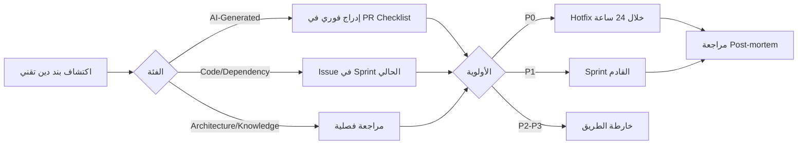

# Evolution Roadmap and Technical Debt Policy

> المسار الزمني للتطوير بعد الإطلاق، سياسات التحديث، وممارسات مراجعة الكود المُولَّد بالذكاء الاصطناعي.

---

## 1. الأفق الزمني بعد الإطلاق (Post-Launch Horizons)

تنقسم خطة التطوير اللاحقة إلى أربعة آفاق زمنية، لكل أفق مخرجات قابلة للقياس ومعايير قبول واضحة تُحدّد متى يُفتح الأفق التالي.

| الأفق | الإطار الزمني | الموضوع الرئيسي | المخرجات الملموسة | معيار الفتح |
|---|---|---|---|---|
| **H0 — الإطلاق التجريبي** | T+0 → T+30 يوم | GA (إصدار عام أولي) لـ MVP | 3 أوضاع دردشة (Private / Hybrid / General)، 5 مصادر للبيانات (Files, URL, GitHub, Notion, Google Drive)، Hybrid Search مع RRF، RLS مُفعّل | SLO أولي: p95 latency ≤ 4s، نجاح الاستيعاب ≥ 95% |
| **H1 — التأسيس** | T+30 → T+90 يوم | MCP Gateway + Multi-Modal | تطبيق مواصفة MCP `2026-07-28` (Stateless)، دعم 12 خادم MCP رسمي، Multimodal Embedding، Embedding Visualizer | p95 latency ≤ 2.5s، تبنّي MCP من قِبل ≥ 30% من المستخدمين النشطين |
| **H2 — النضج** | T+90 → T+180 يوم | Agentic RAG + تحليلات | Agent Loop مع `maxSteps=5`، Side-Effect Confirmation UI، Retrieval Quality Dashboard (Recall@K, MRR, NDCG)، Cost Tracker لكل مستأجر | Recall@10 ≥ 0.80، MRR ≥ 0.65، تقليل Hallucinations بنسبة ≥ 40% عبر Citation Verification |
| **H3 — التوسّع المؤسسي** | T+180 → T+365 يوم | Compliance + Multi-Region | شهادة GDPR Data Export/Delete، تدقيق SOC 2 Type I، MFA إلزامي، Multi-Region Edge (EU/US/APAC)، Audit Log طويل الأمد | اجتياز مراجعة SOC 2، دعم ≥ 10,000 مستأجر متزامن، توافر ≥ 99.9% |

> ملاحظة: مرجعيات SLO ومعايير الجودة مرتبطة بـ [Section: Analytics & Observability](./02-maintenance-workflows-and-knowledge-management.md) في القسم التالي.

---

## 2. سياسة إدارة الدين التقني (Technical Debt Policy)

### 2.1 تصنيف الدين التقني

يُصنَّف كل عنصر من الدين التقني في OmniRAG ضمن فئات واضحة، لكل فئة مالك، وأداة قياس، ومعيار "مقبول / تحذير / حرج".

| الفئة | الوصف | مثال | مالك | أداة القياس |
|---|---|---|---|
| **Code Debt** | كود قديم، أنماط منتهية، تكرار | استخدام `any` في TypeScript | فريق المنصة | ESLint rules + SonarQube |
| **Dependency Debt** | حزم قديمة، ثغرات CVE | Next.js < 16.3، `@modelcontextprotocol/sdk` < 2.0 | فريق الأمان | `npm audit` + Dependabot |
| **Architecture Debt** | قرارات معمارية أصبحت عائقاً | RLS غير مُفعّل على جدول جديد | فريق البنية | مراجعة معمارية فصلية |
| **AI-Generated Debt** | كود مُولَّد بالذكاء الاصطناعي لم يُراجَع | أدوات MCP ذات مدخلات غير صارمة | Tech Lead | PR Review checklist |
| **Knowledge Debt** | وثائق منتهية أو مفقودة | System Prompt قديم في سجل الأدوات | فريق التوثيق | روابط مكسورة أسبوعياً |

### 2.2 سجل الدين التقني (Tech Debt Register)

يُحتفظ بسجل مركزي في `docs/tech-debt-register.md` يحوي عموداً لكل بند، الجدول التالي يوضح المخطط لا الأمثلة الحقيقية:

| ID | الفئة | الوصف | الجهد المقدر | الأولوية | المالك | تاريخ الفتح | الموعد المستهدف | الحالة |
|---|---|---|---|---|---|---|---|---|
| `TD-0001` | Architecture | … | S/M/L | P0–P3 | … | YYYY-MM-DD | YYYY-MM-DD | Open / In Progress / Resolved |

### 2.3 حصص زمنية إلزامية

| النشاط | النسبة | التكرار | الملاحظة |
|---|---|---|---|
| **Spike Days** (بحث واستكشاف) | 10% من السعة | نصف يوم كل أسبوعين | يُسجَّل كل spike في `docs/spikes/` |
| **Debt Repayment** (سداد الدين) | 20% من سعة كل Sprint | Sprint | أولوية P0 تُعالَج قبل أي ميزة جديدة |
| **Refactor Window** | Sprint كامل واحد كل ربع سنة | ربع سنوي | يُخصَّص لإعادة الهيكلة العميقة (مثلاً: فصل طبقة MCP عن RAG Engine) |

### 2.4 قواعد التصعيد

---

## 3. خطة التحديث والترقية (Upgrade Strategy)

### 3.1 موجات التحديث

| الموجة | الإطار | المحتوى | معيار النشر |
|---|---|---|---|
| **Patch** | أسبوعي | إصلاحات أمنية، تحديثات تبعيات `patch` | نشر تلقائي على Preview، ثم Production بعد اجتياز evals |
| **Minor** | شهري | ميزات صغيرة، ترقية `minor` لـ SDK | Feature Flag + 10% Canary → 50% → 100% خلال 72 ساعة |
| **Major** | ربع سنوي | ترقية `major` لـ Next.js / `@modelcontextprotocol/sdk` / نماذج Gemini | خطة ترحيل مفصلة + فترة تشغيل مزدوج (Blue/Green) لمدة 7 أيام |
| **Model Swap** | عند توفر نموذج جديد من Google | تبديل `gemini-3.6-flash` → الإصدار الأعلى | A/B test على 5% من حركة الدردشة لمدة أسبوعين |

### 3.2 ترقيات حرجة مُجدولة

| المكوّن | من | إلى | الموعد المستهدف | المخاطرة | خطة التراجع |
|---|---|---|---|---|---|
| `@modelcontextprotocol/sdk` | 1.x | 2.0 (مواصفة 2026-07-28) | T+45 يوم | متوسطة — تغيير stateless | الإبقاء على فرع 1.x لمدة 30 يوماً بالتوازي |
| Next.js | 16.0 | 16.3+ | T+60 يوم | منخفضة | Vercel Preview rollback فوري |
| `gemini-embedding-2` | — | إصدار `embedding-3` عند توفره | عند الإعلان الرسمي | انقطاع أبعاد المتجهات | تشغيل `re-embed migration script` دُفعياً + إيقاف تدريجي |
| PostgreSQL | 16 | 17 | T+120 يوم | منخفضة — Neon يدير الترقية | Snapshot احتياطي قبل الترقية |

### 3.3 اختبار ما قبل النشر (Pre-Deployment Gates)

كل عملية نشر يجب أن تجتاز البوابات التالية قبل `vercel --prod`:

- [ ] جميع اختبارات الوحدة (`vitest`) خضراء
- [ ] اختبارات التكامل (Postgres + Qdrant + MCP) خضراء
- [ ] Evals للسلوك غير الحتمي خضراء (Rubrics + LM Judge) — التفاصيل في وثيقة Evals
- [ ] لا توجد ثغرات CVE عالية أو حرجة في `npm audit --audit-level=high`
- [ ] لا توجد بنود دين تقني جديدة من فئة `P0` غير مُعالجة
- [ ] تم تشغيل `canary` على Preview لمدة ساعة واحدة بنجاح

---

## 4. ممارسات مراجعة الكود المُولَّد بالذكاء الاصطناعي

### 4.1 مبدأ المسؤولية البشرية

> **"الذكاء الاصطناعي يولّد، الإنسان يُقرّ."** لا يُقبل أي كود مُولَّد بالوكلاء (Cursor / Claude Code / Aider) في `main` دون مراجعة بشرية موثّقة في الـ PR، حتى لو كانت الفحوصات الآلية خضراء.

### 4.2 قائمة مراجعة إلزامية (AI Code Review Checklist)

تُطبَّق هذه القائمة على **كل Pull Request** يحتوي على كود مُولَّد بالذكاء الاصطناعي (مُشار إليه بوصف `AI-assisted` في قالب الـ PR):

#### 🔒 الأمان والعزل
- [ ] كل دالة API Route تتحقق من `tenant_id` ضمن `request.context` (لا تثق بـ body)
- [ ] كل أداة MCP تأخذ `tenant_id` كمعامل إلزامي في مخطط Zod
- [ ] لا توجد أسرار (API keys, tokens) مُضمّنة في الكود — تُجلب من `MCPSecretVault`
- [ ] استعلامات SQL تستخدم RLS-bound session — لا `SELECT *` بدون فلتر `tenant_id`

#### 🏗️ المعمارية والأنماط
- [ ] المنطق التجاري في `/lib/` أو `/domain/` — ليس داخل `route.ts` أو مكوّن React
- [ ] أي استدعاء لـ Gemini يستخدم `@ai-sdk/google` مع `taskType` واضح
- [ ] أي أداة MCP جديدة مسجّلة في `MCPToolRegistry` مع:
  - اسم وصفي (Tool Naming SEP-986)
  - مخطط Zod صارم
  - إفصاح صريح عن `has_side_effect`
- [ ] لا استخدام لـ `any` أو `unknown` غير مُقيّد في TypeScript

#### 🌐 ثنائية اللغة
- [ ] أي رسالة جديدة للنظام أو للمستخدم تُضاف لـ `i18n/messages/{ar,en}.json`
- [ ] تقسيم النصوص العربية يحترم اتجاه RTL (لا قطع جمل في المنتصف)
- [ ] اختبار `language=ar` يجتاز في Evals

#### ⚡ الأداء والتكلفة
- [ ] لا استدعاء نموذج داخل حلقة (loop) — استخدم `generateText({maxSteps})` من Vercel AI SDK
- [ ] تخزين مؤقت (cache) مفعّل لنتائج البحث المتطابقة (مفتاح: `tenant_id + query_hash`)
- [ ] تضمين جماعي (`batch`) عند معالجة > 10 أجزاء

#### 🧪 الاختبارات والتقييمات
- [ ] اختبارات وحدة للمنطق التجاري الجديد
- [ ] اختبار تكامل مع Postgres + Qdrant (حقيقي، ليس mock)
- [ ] Eval واحد على الأقل إذا كانت الميزة غير حتمية (مثل: جودة إجابة RAG)

#### 📝 التوثيق
- [ ] تحديث `CHANGELOG.md` بإدخال في قسم `[Unreleased]`
- [ ] إذا أُضيفت أداة MCP جديدة: تحديث `/mcp-hub` ووصفها في `docs/mcp-catalog.md`
- [ ] إذا تغيّر مخطط API: تحديث OpenAPI schema

### 4.3 تقسيم أدوار المراجعة

| دور المراجع | مسؤول عن | زمن الاستجابة المستهدف |
|---|---|---|
| **AI Code Reviewer Bot** (فحص آلي) | lint، types، security scan، secrets detection | < 5 دقائق |
| **Reviewer بشري (Peer)** | منطق الأعمال، قابلية القراءة، الالتزام بالقائمة أعلاه | < 4 ساعات عمل |
| **Tech Lead** | القرارات المعمارية، ترقيات SDK، أدوات MCP الجديدة | < 24 ساعة |
| **Security Reviewer** | أي تغيير في Auth/RLS/OAuth، أي أداة جديدة ذات آثار جانبية | < 24 ساعة، قبل الدمج |

### 4.4 أدوات المراجعة الآلية

| الأداة | الغرض | الفحص |
|---|---|---|
| **ESLint + `eslint-plugin-security`** | أنماط أمنية وأنماط كود | كل PR |
| **TypeScript `--strict`** | فحص الأنواع | كل PR |
| **Snyk / Trivy** | ثغرات التبعيات | يومياً + كل PR |
| **Semgrep** | أنماط RLS، أسرار مكشوفة، `dangerouslySetInnerHTML` | كل PR |
| **Vercel AI SDK Evals** | تقييم جودة مخرجات LLM | عند تغيير Prompt أو نموذج |
| **custom MCP Audit Linter** | التحقق من أن كل أداة MCP جديدة مسجّلة بشكل صحيح | كل PR |

---

## 5. نواحي AI-Specific الدين التقني

تستحق الكود المُولَّد بالذكاء الاصطناعي انتباهاً خاصاً لأنماط شائعة يغفلها الوكلاء:

| النمط | لماذا هو خطر | كيف نكشفه | الإجراء |
|---|---|---|---|
| **Tool Over-Trust** | الوكيل يستدعي أداة MCP دون تحقق من `tenant_id` | Semgrep rule: `mcp_call_without_tenant` | رفض الـ PR |
| **Prompt في الكود** | وضع System Prompt حساس داخل `route.ts` مكشوف للعميل | Custom lint: `inline_prompt_in_route` | نقل إلى `/lib/prompts/` |
| **Insecure Deserialization** | تمرير `JSON.parse(user_input)` مباشرة إلى LLM | ESLint rule + taint analysis | تعقيم عبر `zod` schema |
| **Silent Token Burn** | استدعاء `generateText` في حلقة غير محددة | Custom analyzer: `loop_contains_llm_call` | إضافة `maxSteps` إلزامي |
| **Stale Schema** | مخطط Zod لا يعكس تطورات API الخارجي | مراجعة ربع سنوية | تحديث + تشغيل evals |
| **Embeddings Mismatch** | استخدام نموذج تضمين للاستعلامات وآخر للمستندات | فحص آلي لأسماء النماذج في كود التضمين | توحيد + إعادة تضمين |

---

## 6. سياسة إزالة الميزات المنتهية (Sunset Policy)

| المرحلة | المدة | الإجراء |
|---|---|---|
| **إعلان الإيقاف** | قبل 60 يوماً | Banner في الواجهة + Email + CHANGELOG |
| **Deprecation** | 30 يوماً | الأداة/الميزة تعمل مع `console.warn` وميزة `X-Sunset-Date` header |
| **Read-Only** | 14 يوماً | الأداة تعمل قراءة فقط |
| **Removal** | — | حذف الكود + تحديث الوثائق |

---

## 7. معايير النجاح (Acceptance Criteria)

تعريف "جاهز" لكل عملية تطوير لاحقة:

| المعيار | الوصف | القياس |
|---|---|---|
| **Specification First** | لا ميزة جديدة دون PRD وTests + Evals مُحدَّدة قبل بدء الكود | مراجعة PR |
| **Tech Debt ≤ Threshold** | عدد بنود `P0/P1` المفتوحة ≤ 3 في أي وقت | Tech Debt Register |
| **AI Review Checklist** | كل PR يحتوي كود AI يملأ القائمة كاملة | فحص CI |
| **Zero-Downtime Deploys** | لا انقطاع في الإنتاج > 30 ثانية | Vercel Analytics |
| **Quarterly Upgrade SLA** | كل تبعيات `major` جديدة تُدمج خلال ربع سنة | Dependabot dashboard |
| **Documentation Parity** | كل تغيير في الكود يُحدِّث الوثائق في نفس الـ PR | CI check على روابط مكسورة |

---

## 8. المرجعيات

- [Section: Maintenance Workflows and Knowledge Management](./02-maintenance-workflows-and-knowledge-management.md) — يحدد سير الصيانة الدوري، نموذج تشغيل الفريق، واستراتيجيات توسيع الوثائق
- وثيقة بنية النظام: `/docs/architecture.md`
- ميثاق الوكلاء: `/AGENTS.md` — قواعد إلزامية لكل وكيل برمجي
- سجل MCP: `/docs/mcp-catalog.md`

---

> **مبدأ التحديث المستمر:** كل ربع سنة يُعاد تقييم هذه الخارطة بناءً على بيانات الاستخدام وردود الفعل وتعليقات العملاء. أي انحراف عن المسار يُسجَّل ويُبرَّر في `docs/roadmap-decisions.md`.